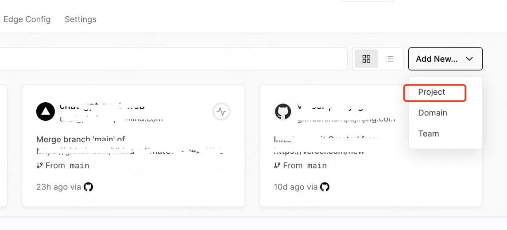
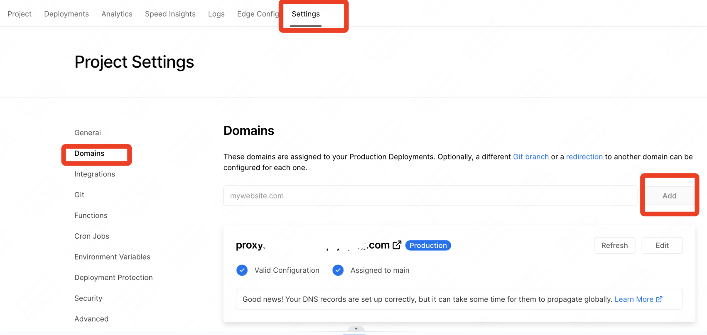
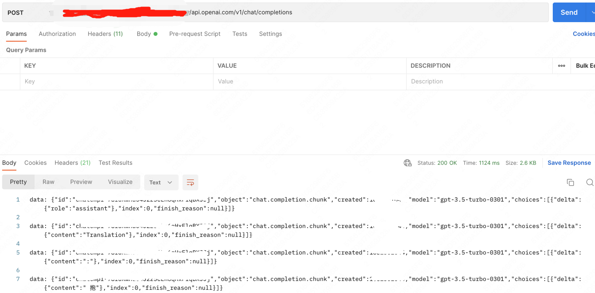

# vercel-api-proxy
[English README](./README_EN.md)

本项目是vercel反向代理。完全免费，万能代理，可代理全网一切接口，包括openai、github、google、Telegram等等。http和https接口、单页面均可代理，在网络环境不好的情况下均可用。（直接浏览器打开代理页面的情况下，由于某些js和css的路径可能会不对造成访问不到，页面样式有点小问题。）

vercel现在每月有100GB的免费流量。

## 部署

## 使用方法
1 部署。部署有两种方法，一是直接点击上方按钮一键部署，二是可以先fork本项目，再登录[vercel](https://vercel.com/)网站新建

2 绑定自己的域名(不是必须，使用vercel自带的子域名也可以，但是自带的域名vercel.app在国内网络环境不好的情况下不可用) 可以申请[tk免费域名](http://www.dot.tk/)或者薅小域名注册商首年免费羊毛

绑定域名时按照vercel上的说明配置即可，其实就是在你的域名上配了一个子域名，cname到vercel服务器

3 访问 域名/https/url  或者/http/url即可。
映射规则为/https/url映射到https接口，/http/url映射到http接口

## 示例
例1 访问https://替换为你自己的域名.com/https/api.openai.com/v1/chat/completions 
实际上会替换为https://api.openai.com/v1/chat/completions

如何在一些常见的开源项目中使用？
一般开源项目都是引用的openai的库，可以看到里面有一个属性是api_base = os.environ.get("OPENAI_API_BASE", "https://api.openai.com/v1")

所以使用的时候只需要设置一下openai.api_base="https://你的域名/https/api.openai.com/v1" 就可以了

例2 访问https://你的域名.com/https/raw.githubusercontent.com/souying/serverMmon/
实际上会替换为https://raw.githubusercontent.com/souying/serverMmon/

映射规则为/https/url映射到https接口，/http/url映射到http接口

也可用于github下载加速。假如原始链接是https://objects.githubusercontent.com/github-production-release-asset-2e65be/xxxxxx 
改为https://替换为你自己的域名.com/https/objects.githubusercontent.com/github-production-release-asset-2e65be/xxxxxx 就可以加速了。下图是github原始链接和加速后对比。可以看到效果杠杠的，每秒50kb小水管变成了每秒2-3mb

例3 访问https://你的域名.com/https/www.google.com/search?q=vercel-api-proxy
实际上会替换为https://www.google.com/search?q=vercel-api-proxy

代理google搜索结果页面
